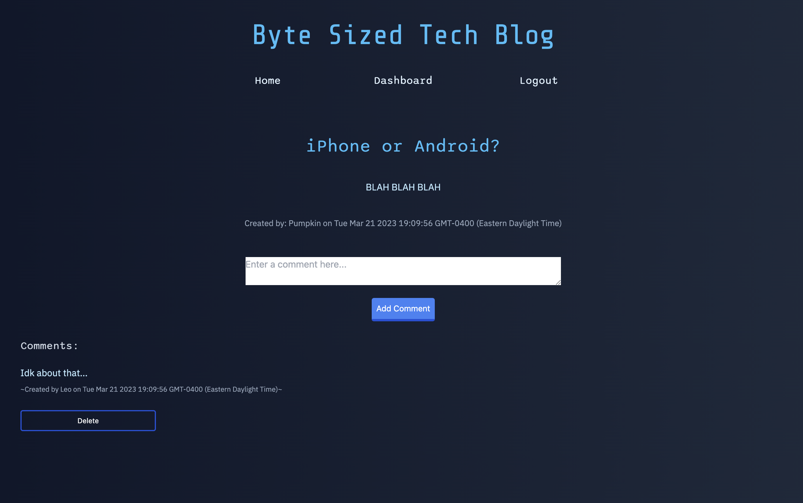
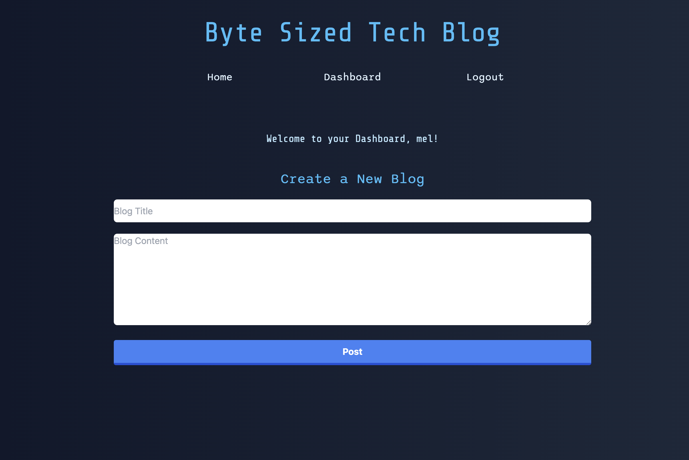
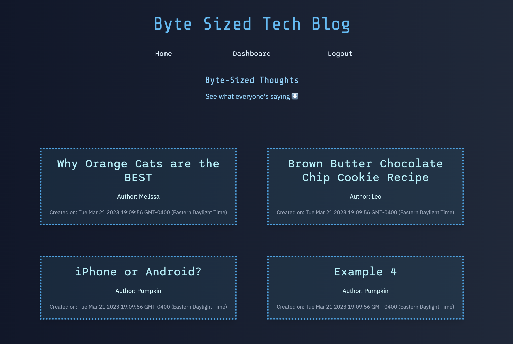

# ByteSized-TechBlog


Model-View-Controller (MVC) Challenge: Tech Blog

## Description

This project was created using the Model, View, Controller (mvc) paradigm and is hosted on Heroku with Heroku Deployment. it can also be run locally using the files from the github repository. To do this, the Installation and Usage sections must be read. Node.js and express are used for the server and sequelize is utilized to access the mysql database called "tech_blog_db". this database stores all user, post, and comment information. The live version is hosted on Heroku, with the JAWSDB add on to store the data. the passwords are all encrypted with the bcrypt Node.js package and the HTML views are created with Handlebars.js.

## User Story

AS A developer who writes about tech
I WANT a CMS-style blog site
SO THAT I can publish articles, blog posts, and my thoughts and opinions

## Link to App

https://bytesizedtechblog.herokuapp.com/

## Screenshot of App





## Instructions for Use

### Installation

Clone this repository to your local machine.

Right click on server.js and select "Open in Integrated Terminal"

There should be a package.json file included. To install the various npm packages used run the command

```md
npm i
```

### Usage

Update the env.EXAMPLE file name to .env (delete .EXAMPLE from the name) and update with your username and password for MySql.

Once everything is installed and updated with your information, run the following commands to create your database, tables, and put seed information to get started.

```md
mysql - u root -p

<yourpassword>

SOURCE db/schema.sql;

exit

npm run seed
```

Run the following command to get the server running

```md
node server.js
```

## License

MIT license.

## Questions

meltee@live.com

## Credits

Primary Tutor: Martin Gulberg
